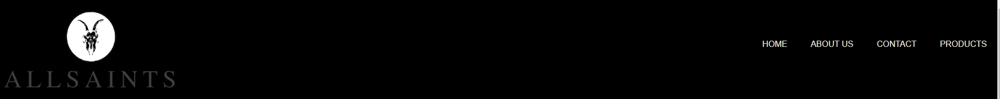
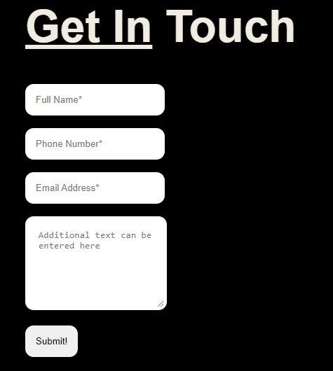
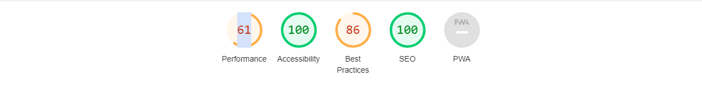
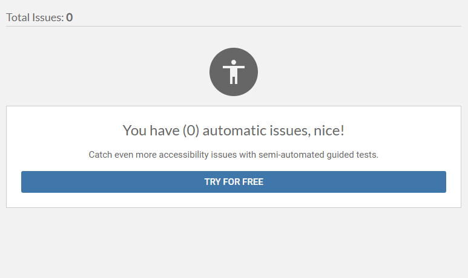

# All Saints Parfum Collection.
This website is created as an infomation website on perfume(All Saints) and history of it. Discover an aromatic collection of perfumes crafted to enkindle emotions and leave a great impression. This website is a gateway to a world of captivating scents that cater to diverse preferences. This site provides a detailed information on the All Saints Brand giving the how and when it started, how this brand grew to be a household name and a lilttle quiz for our collectors for this brands.
<hr>
Visit site <a href="https://okohdaniel11.github.io/Project1/index.html"><u>here.<u></a>
<br>
  
## Table of Contents

- [Introduction](#introduction)
- [Features](#features)
- [Testing](#testing)
- [Credits](#credits)
- [License](#license)
  
<hr>

## Introduction

The purpose of the website is mainly for people who are fans of the brand allsaints to check it out for information to show the user how the brand started how far they've grown and to learn more about the brand that they do not know. The main target audience will be for people  who are fans of the brands and those who have discovered this brands through buying little from thier shops and also thoe who are curious.

## Project goals

1. Show information about AllSaints.
2. Show what Allsaints has produced over time.
3. Show how to get in contact with the with us.

## Features
This site implements very basic feature.
<br>
## Existing Features
- **Navigation Bar**
  - Featured on the header all four pages on the right includes Home page, About us Page, Products Page, Contact Page with logo on the left aswell.
  <br>
  <br>


- **Main Content**
  - Main sections throughout the site have a consistent layout and styling to convey the infomation on site clearly.
  -

- **Footer**
    - The footer contains 3 icons linking to thier social media platforms.
    -  The icon are styled in the sites primary colours and are consistent on all pages.
      <br><br>
      
 
- **Contact Section**
    - On the contact page is a form to fill out to get in touch with us.
    - Name, Email and Phone Number are mandotory fields and message box are optional.
    - Filling the form will take them to a dump page provided by Code Institute
      <br><br>
      
 
- **Product Page Details**
    - The product page entails products created by allsaints 
    - Quick summarry about products beside images
      <br><br>
      
 
## Possible Future Features 
   - Pages for items in product page
      
      As I go on with this page I would like to add individual pages for the items that are on the pages also for the picture to change as you hover on the pictures.
      to have them enlarge as you hover on the pictures.

   - Adding a quiz page for fun
     
      I want to add a quiz page as more of a fun event while browsing the website I believe it'll be more enjoyable while browsing.
     
  - To add a forum

    I want to add a forum where people can talk about the brand and also give thier own experience either buying stuff from the brand or in stores.

## Testing

**Validator Testing**
- HTML (<a href="https://validator.w3.org/">W3C validator</a>)
  - Error: Bad value images/favicon (1).ico for attribute href on element link: Illegal character in path segment: space is not allowed.
   From line 11, column 9; to line 11, column 75  ```<link rel="icon" href="images/favicon (1).ico" type="image/x-icon">```


- CSS ([Jigsaw](https://jigsaw.w3.org/css-validator/))
  - No Errors Found
  
  
- Performance, Accessibility, SEO, Best Practices ([Lighthouse Chrome DevTools])
  
  
  
- Accessibility ([axe DevTools](https://axe.deque.com/install-success))
  
  

### Browser Testing

**Layout:** Testing layout and appearance of site for consistency throughout browsers.

**Functionality:** Ensuring all links, navigation and form submit functions as expected throughout browsers.

| Browser     | Layout      | Functionality |
| :---------: | :----------:| :-----------: |
| Chrome      |✔️    |✔️       |
| Edge        | ✔️   |✔️       |
| Opera       |✔️    |✔️       |
| Firefox     |❌    |✔️       |
| Safari      |❌    |❌       |


### Manual Testing

| Feature     | Expect      | Action        | Result |
| :---------: | :----------:| :-----------: | :-----:|
| **Logo Icon**   | When clicked, home page will open   | Clicked Logo Icon  | Home page opened when clicked |
| **Navbar**  | When clicked, the respective page will open  | Clicked all individual navbar buttons | All respective pages opened when button was clicked |
| **Contact link on About page main** | When clicked,the Contact page will open | Click contact link | Contact page opens |
| **Social link icons** | Social link icons open relevant websites in new tab when clicked| Click all individual icons | All respective sites open in new tab |
| **Required form fields** | form will not submitif required fields are blank and fields will be highlighted and flagged | Fill out form incorrectly | Form does not submit and highlights incorrectly filled in fields |

  
## Credits

### Media
- All pictures were taken from Google Images and AllSaint Instagram
- Logo was taken from [Font Awesome](https://fontawesome.com/icons/css3?f=brands&s=solid)
- 
### Content
- Fonts were taken from [W3Schools](https://www.w3schools.com/cssref/css_websafe_fonts.php)
- CSS color design were taken from [She Codes Coding tool](https://palettes.shecodes.io/palettes/brown/color)
  
## License

